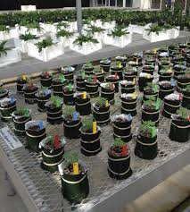

## Layout of different types of experiments
 
 
 

--- .class #id


## Purpose of project

1. In research the randomizations of experimental treatments is extremely important for 
    statistical analysis.  Whether the experimental units are plots in a field, trees in an orchard
    or plants on a bench in a greenhouse/growth chambe, It is critical to assign the treatments at
    random.
2.  The shape of the fields or orchards are variable.  Consequently, the app needs the 
    flexibality to handle variable field size, number of rows and columns.
3. There are several ways to randomize experimental units.  A second step is needed to assign
    treatments to randomized eperimental units. This app combines both the randomization of 
    experimental units and assignment of treatments.

---

   
## How the project was implemented
1. Choose the matrix as the best data structure.
2. Chose algorthim for randomizing experimental units- "sample"" function. 
3. Create vector with randomized experimental units.
4. Create matrix.
  +  First column with treatments numbers from 1 to with a treatment number for each replicate
  +  Second column contains 1 thru total number of experimental units.
5. Conversion of randomizes experimental units to randomized treatment number.
6. The app does not deal with irregularly shaped layouts.  An additional step would be required
to adjust the assignment of randomized treatments to the irregulary shape.

--- .class #id

## Output of shiny app to randomized treatment
1. Number of columns:    3
2. Number of rows:       5
3. Number of Treatments: 5
4. Number of Replicates: 3

```{r, echo=FALSE}
        # initiate loop control counters
        trtNo <- 1 # loop control
        trt <- 0 # loop control
        x <- 0 # loop control
        matrixWidth <- 3
        matrixLength <- 5
        noTreatments <- 5
        noRepicates <- 3
        

        # Calculate total number of cells in Matrix 
       totalCells <- matrixWidth * matrixLength
        #totalCells <- matrixWidth * matrixLength
        
        
        # Create vector of randomized cell numbers for the total number of observatuins in the vector  
        Matrix <- sample(1:totalCells, totalCells,  replace=FALSE)
        
        matrixTrt <- seq(1:length(Matrix)) # vector of treatments
        
        matrixSeq <- seq(1:length(Matrix)) # Vector of experimental units
        
        # Initially set all units to 0. so that when there are more matrix cells
        # then experimental units.  Any unused cells will have treatment = 0
        matrixSeq[] <- 0 
        
        combMatrix <- c(matrixSeq,matrixTrt)
        dim(combMatrix) <- c(totalCells,2)
        
        # Assign the treatment number with appropriate number of replications to first column of combMatrix    
        # Assign the sequential plot numbers in the second column
       for( j in 1:noTreatments){

            trt <- trt +1
            for( k in 1:noRepicates){

                x <- x +1
                combMatrix[x,1] <- trt
            }
        }
        
        # The plot number are read in there randomized order.
        # The  plot numbers are read in order from the vector containing the randomized plot number.
        # The treatment number is read from the the matrix containing the treatments with associated plot number.
        # The corresponding treatments are assigned to a new vector.
        # This new vector is converted to a matrix and outputted.
        matrixExp <- vector(mode="integer", length= totalCells)   
        for(m in 1:totalCells){
            matrixExp[m] <- combMatrix[ Matrix[m],1]
        }
        dim(matrixExp) <- c(matrixLength,matrixWidth)
        storage.mode(matrixExp) <- "integer"
        matrixExp      
        
    

```    
---


